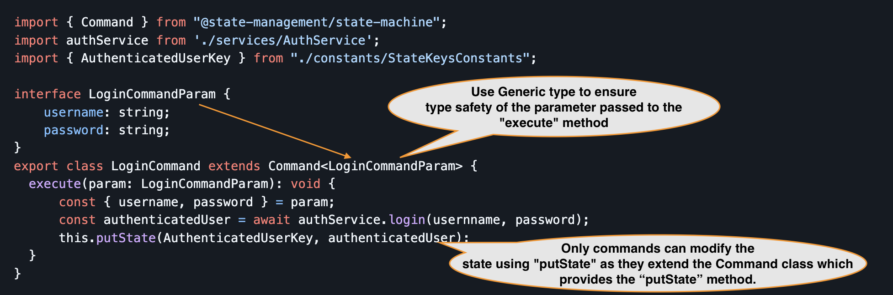
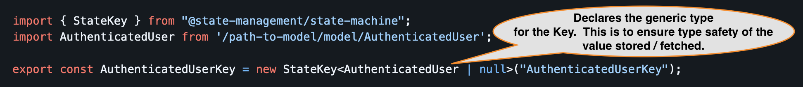
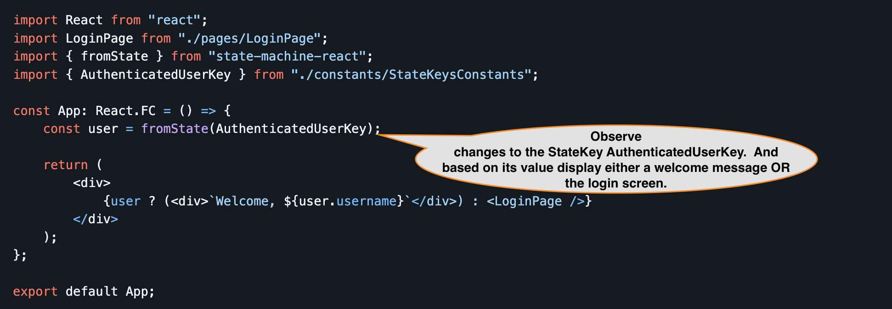

# State-Machine-React - Implementation / Readability / Maintenance.

State management in a medium or large React application is a critical, and yet it is often complex, making the code difficult to follow, especially for new team members.
Easy **Traceability** and Clean code is the most important aspect we focus on in the
[state-machine-react](https://www.npmjs.com/package/@state-management/state-machine-react) package.  

This is a lightweight library for react built on top of the [simple-state-machine](https://www.npmjs.com/package/@state-management/simple-state-machine) typescript library.
We also have package for Angular built on top of the `simple-state-machine`

Lets look into a example implementation of the simple login use case in a React application.

We’ll explore how to:
1. Separate reading of state from writing state updates. 
2. Implement clean, testable code following the Atomic Design pattern. 
3. Encapsulating application logic into Command objects, for example the login logic.
4. And most importantly, verify that the code is easy to read, trace, understand, especially for new team members

## Setup a new Project
1. Create a react project. 
2. Install React, [state-machine-react](https://www.npmjs.com/package/@state-management/state-machine-react) libraries:

## Implement the Code

### LoginPage.tsx

<details>
<summary style="color: royalblue; text-decoration: underline;">Expand to see the above code as plain text and to copy</summary>

```typescript
import React, { useState } from "react";
import { useDispatcher } from "state-machine-react";
import { LoginCommand } from "../commands/LoginCommand";

const LoginPage: React.FC = () => {
const [username, setUsername] = useState("");
const [password, setPassword] = useState("");

    const dispatch = useDispatcher();

    const handleLogin = () => {
        dispatch(new LoginCommand({ username, password }));
    };

    return (
        <div>
            <h1>Login</h1>
            <input
                placeholder="Enter username"
                value={username}
                onChange={(e) => setUsername(e.target.value)}
                />
            <input
                placeholder="Enter password"
                value={password}
                onChange={(e) => setPassword(e.target.value)}
                />                    
            <button onClick={handleLogin}>Login</button>
        </div>
    );

export default LoginPage;
```
</details>

#### Key Points about the `LoginPage.tsx`
1. **UI-Only Logic**:
The LoginPage.tsx focuses solely on the login UI logic, keeping the code modular and clean.  It does not handle validation, API calls, or other business logic.
2. **Handling the Login Action**:
When the Login button is clicked, it creates an instance of LoginCommand and dispatches it to handle the login process.  This approach simplifies user event handling.
3. **Encapsulation of Business Logic**:
The [LoginCommand.ts](#LoginCommandts) encapsulates all validations, login logic, and related operations. This separation of concerns keeps the UI code clean, maintainable, and easy to unit test.

In the following sections, we will explore
  - how to ensure the type safety for the constructor parameter passed to the LoginCommand.
  - How the LoginCommand accesses and utilizes this parameter during execution.
  - How the LoginCommand updates the state.

### `LoginCommand.ts`

<details>
<summary style="color: royalblue; text-decoration: underline;">Expand to see the above code as plain text and to copy</summary>

```typescript
import { Command } from "@state-management/state-machine";
import authService from './services/AuthService';
import { AuthenticatedUserKey } from "./constants/StateKeysConstants";

interface LoginCommandParam {
    username: string;
    password: string;
}
export class LoginCommand extends Command<LoginCommandParam> {
  execute(param: LoginCommandParam): void {
      const { username, password } = param;
      const authenticatedUser = await authService.login(usernname, password);
      this.putState(AuthenticatedUserKey, authenticatedUser);
  }
}
```
</details>

#### Key Points about the LoginCommand.ts

1. **Extending the Command Class**:
The LoginCommand extends the Command class provided by the state-machine-react package and implements the execute method.
2. **Generic Type Declaration and Type-Safe Parameter**:
LoginCommand declares a generic type parameter <LoginCommandParam>. This type represents the parameter that the execute method will receive, ensuring type safety throughout.
The generic <LoginCommandParam> guarantees that the command operates on the expected parameter type, preventing runtime type errors.
3. **Command Usage**:
The [LoginPage.tsx](#LoginPagetsx) constructs a LoginCommand instance by passing an object of type LoginCommandParam as the parameter.
4. **Handling Asynchronous State Updates**:
The execute method calls authService.login. You can handle asynchronous behavior using either `await` or `.then`. Both approaches allow you to update the state asynchronously while maintaining the same application behavior.
5. **Restricted State Modification**:
The putState method is exclusively available to commands for modifying state as a side effect of their execution. This encapsulates state changes within the command, ensuring a clean separation of concerns.

Since this was a simple example, we did not include validation logic. However, you can easily add validation within the command and update the state accordingly if validation fails.

In the following sections, we will cover
- how to declare the `StateKey` used in the putState call from the command.
- A simple implementation of the authService used by the LoginCommand

### StateKeyConstants.ts

<details>
<summary style="color: royalblue; text-decoration: underline;">Expand to see the above code as plain text and to copy</summary>

```typescript
import { StateKey } from "@state-management/state-machine";
import AuthenticatedUser from './model/AuthenticatedUser';

export const AuthenticatedUserKey = new StateKey<AuthenticatedUser | null>("AuthenticatedUserKey");
```
</details>

#### Key Points about the StateKeyConstants.ts
- The keys declared in this file are of type `StateKey<T>`, where `T` represents the type of value stored in the state for each key.
- The `StateKey` declares a generic type associated with it, defining the type of value it references in the state.
- This ensures compile time type safety for values stored in the state against these keys.
- It also guarantees type safety when observing or retrieving the value associated with a key. 


And here is the authentication service used by the [LoginCommand.ts](#LoginCommandts).
It is simple service that makes an HTTP call to validate the credentials.

### AuthenticationService.ts
```typescript
const authService = {
    login: async (username: string, password: string): Promise<AuthenticatedUser> => {
        const response = await axios.post<AuthenticatedUser>(
            ServiceConstants.LOGIN_URL, {
            username,
            password,
        });
        return response.data;
    },
};

export default authService;
```

And finally we put it all together in the main App.tsx

### App.tsx

<details>
<summary style="color: royalblue; text-decoration: underline;">Expand to see the above code as plain text and to copy</summary>

```typescript
import React from "react";
import LoginPage from "./pages/LoginPage";
import { fromState } from "state-machine-react";
import { AuthenticatedUserKey } from "./constants/StateKeysConstants";

const App: React.FC = () => {
    const user = fromState(AuthenticatedUserKey);

    return (
        <div>
            {user ? (<div>`Welcome, ${user.username}`</div>) : <LoginPage />}
        </div>
    );
};

export default App;
```
</details>

#### Key Points about the App.tsx
- The `App.tsx` uses the `fromState` hook to read and observe the value associated with a specific `StateKey`.  In this case the AuthenticatedUserKey defined in the [StateKeyConstants.ts](#StateKeyConstantsts) 
- Similar to React's `useState` hook, the component automatically re-renders when the observed state (e.g., the `"user"`) changes.
- The example demonstrates a clear separation between reading/observing state and updating state:
    - The [LoginCommand](#LoginCommandts), dispatched from the [LoginPage](#LoginPagetsx), updates the state. Components dispatch commands to modify the state.
    - Multiple components, such as a `Header` or `App.tsx`, observe and read the state. These components handle UI updates in response to state changes.

