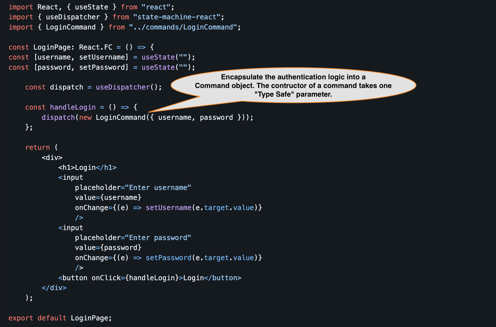

# State-Machine-React - Implementation / Readability / Maintenance.

State management in a medium or large React application is a critical, and yet it is often complex, making the code difficult to follow especially for new team members.
Easy **Traceability** and Clean code is the most important aspect we focus on in the
[state-machine-react](https://www.npmjs.com/package/@state-management/state-machine-react) package.  

This is a lightweight library for react built on top of the [simple-state-machine](https://www.npmjs.com/package/@state-management/simple-state-machine) typescript library.
We also have package for Angular built on top of the `simple-state-machine`

Lets look into a example implementation of the simple login use case in a React application.

We’ll explore how to:
1. Separate reading of state from writing state updates. 
2. Implement clean, testable code following the Atomic Design pattern. 
3. Encapsulating application logic into Command objects, for example the login logic.
4. And most importantly, verify that the code is easy to read, trace, understand, especially for new team members

## Setup a new Project
1. Create a react project. 
2. Install React, [state-machine-react](https://www.npmjs.com/package/@state-management/state-machine-react) libraries:

## Implement the Code

### LoginPage.tsx

<details>
<summary>Expand to see the above code as plain text and to copy</summary>

```typescript
import React, { useState } from "react";
import { useDispatcher } from "state-machine-react";
import { LoginCommand } from "../commands/LoginCommand";

const LoginPage: React.FC = () => {
const [username, setUsername] = useState("");
const [password, setPassword] = useState("");

    const dispatch = useDispatcher();

    const handleLogin = () => {
        dispatch(new LoginCommand({ username, password }));
    };

    return (
        <div>
            <h1>Login</h1>
            <input
                placeholder="Enter username"
                value={username}
                onChange={(e) => setUsername(e.target.value)}
                />
            <input
                placeholder="Enter password"
                value={password}
                onChange={(e) => setPassword(e.target.value)}
                />                    
            <button onClick={handleLogin}>Login</button>
        </div>
    );

export default LoginPage;
```

</details>


The code above only has UI logic.  On click of the `Login` button it dispatches a command to handle the login logic.
The Command object encapsulates the validations, login logic, etc. This keeps the UI clean and unit testable.

### LoginCommand.ts
```typescript
import { Command } from "@state-management/state-machine";
import authService from '/path-to-service/services/AuthService';

interface LoginCommandParam {
    username: string;
    password: string;
}
export class LoginCommand extends Command<LoginCommandParam> {
  execute(param: LoginCommandParam): void {
      const { username, password } = param;
      const authenticatedUser = await authService.login(usernname, password);
      this.putState(UserKey, authenticatedUser);
  }
}
```
You extend the LoginCommand from the `Command` provided the state-machine-react package and implement the `execute` method.
- Note the Command class has a generic <LoginCommandParam>.
- The LoginPage.tsx constructed a command passing an object of type <LoginCommandParam>
- This generic <LoginCommandParam> is the type of the parameter that the `execute` method will receive.


### AuthenticationService.ts
```typescript
const authService = {
    login: async (username: string, password: string): Promise<AuthenticatedUser> => {
        const response = await axios.post<AuthenticatedUser>(
            ServiceConstants.LOGIN_URL, {
            username,
            password,
        });
        return response.data;
    },
};

export default authService;
```

Here is the state key that is updated by the login command.
### StateKeyConstants.ts
```typescript
import { StateKey } from "@state-management/state-machine";
import AuthenticatedUser from '/path-to-model/model/AuthenticatedUser';

export const AuthenticatedUserKey = new StateKey<AuthenticatedUser | null>("AuthenticatedUserKey");
```

And finally in the App.tsx
### App.tsx
```typescript
import React from "react";
import LoginPage from "./pages/LoginPage";
import { fromState } from "state-machine-react";
import { AuthenticatedUser } from "./constants/StateKeysConstants";

const App: React.FC = () => {
    const user = fromState(AuthenticatedUser);

    return (
        <div>
            {user ? (<div>`Welcome, ${user.username}`</div>) : <LoginPage />}
        </div>
    );
};

export default App;
```
